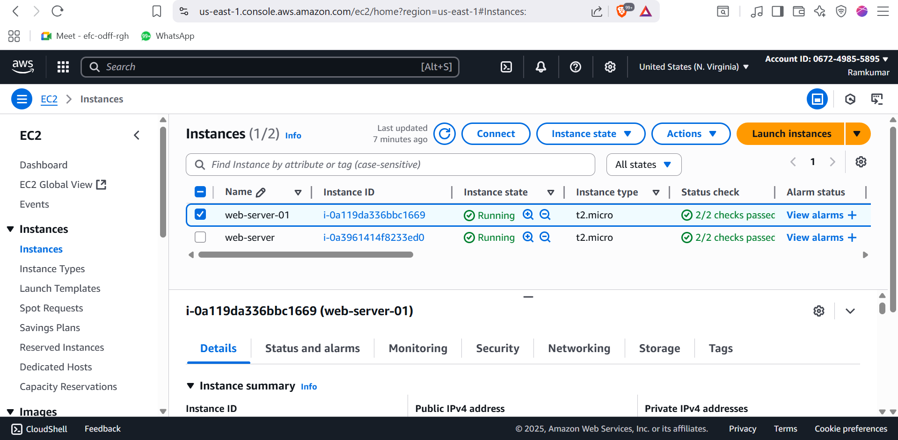
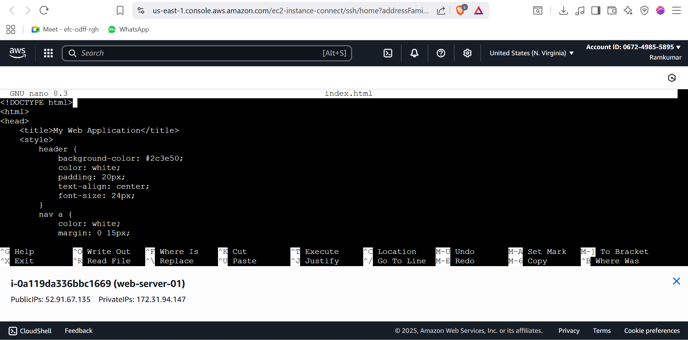
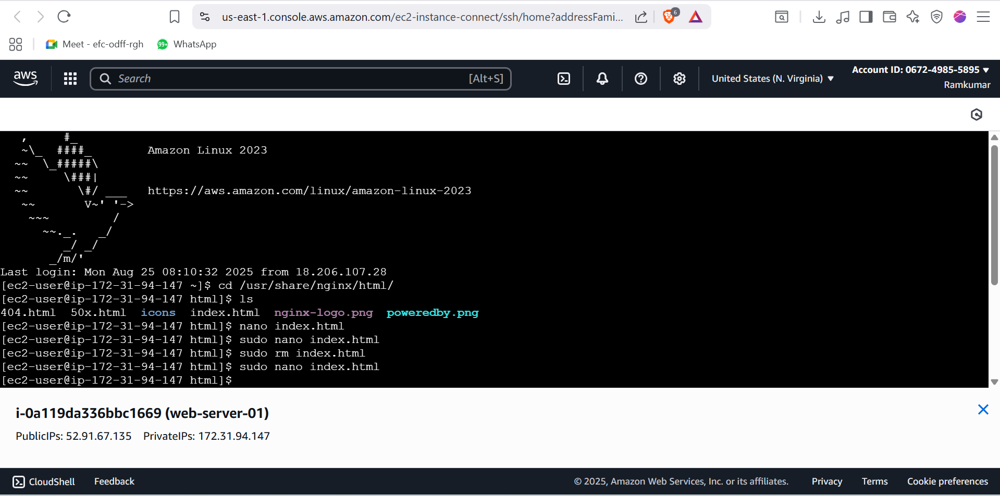
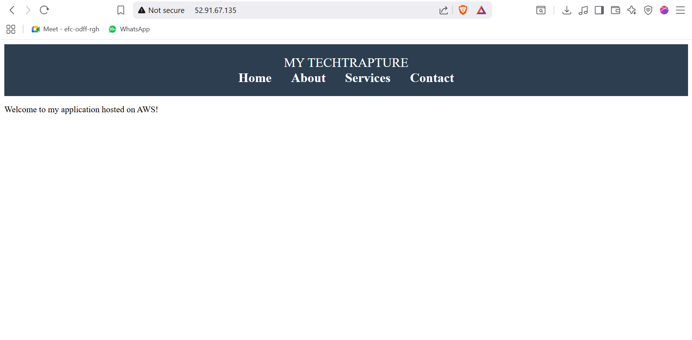

## EC2_web_application


#  Web application on AWS EC2  

This project demonstrates how I, as a **Cloud Engineer**, launched an **EC2 instance**, installed **Nginx**, deployed a static website, and accessed it using the public IP address.  

---

##  Project Screenshots  

### 1. EC2 Instances Running  
Launched two **EC2 instances** (`t2.micro`) in **N. Virginia (us-east-1)**.  
  

---

### 2. Editing index.html File  
Connected to the EC2 instance using **SSH (EC2 Instance Connect)** and created a custom `index.html` file.  
  

---

### 3. Nginx Web Server Setup  
Replaced the default Nginx web page with the new `index.html` under `/usr/share/nginx/html/`.  
  

---

### 4. Hosted Application Output  
Accessed the website using the **EC2 Public IPv4 address** in the browser.  
  

---

##  Workflow  

1. **Launch EC2 Instance**  
   - Amazon Linux 2023 AMI  
   - Instance type: `t2.micro`  
   - Security Group → Allowed **SSH (22)** & **HTTP (80)**  

2. **Install & Configure Nginx**  
   ```bash
   sudo yum update -y
   sudo amazon-linux-extras enable nginx1
   sudo yum install nginx -y
   sudo systemctl start nginx
   sudo systemctl enable nginx

## Example index.html Code

<!DOCTYPE html>
<html>
<head>
    <title>MY TECHTRAPTURE</title>
    <style>
        body {
            font-family: Arial, sans-serif;
            margin: 0;
            padding: 0;
        }
        header {
            background-color: #2c3e50;
            color: white;
            padding: 20px;
            text-align: center;
            font-size: 24px;
        }
        nav {
            text-align: center;
            background: #34495e;
            padding: 10px;
        }
        nav a {
            color: white;
            margin: 0 15px;
            text-decoration: none;
            font-weight: bold;
        }
        section {
            padding: 20px;
            text-align: center;
        }
    </style>
</head>
<body>
    <header>
        MY TECHTRAPTURE
    </header>
    <nav>
        <a href="#">Home</a>
        <a href="#">About</a>
        <a href="#">Services</a>
        <a href="#">Contact</a>
    </nav>
    <section>
        <h2>Welcome to my application hosted on AWS!</h2>
    </section>
</body>
</html>


## Final Output 
